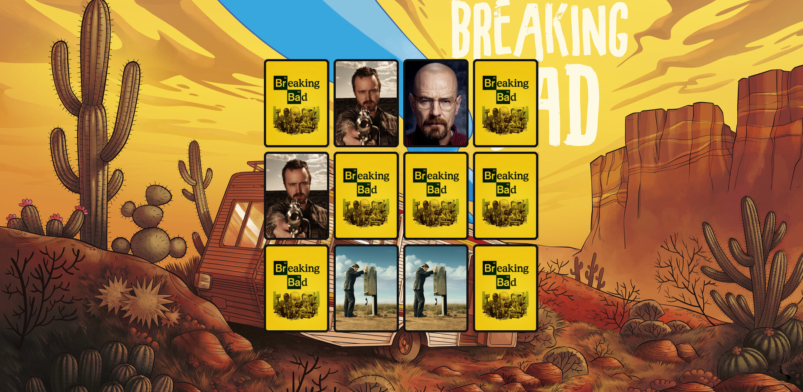

# Jogo da memória :man_technologist::memo::black_joker:
* Jogo da memória inspirado em Breaking Bad. :man_scientist:

* Feito juntamente com o curso "Desenvolvendo um jogo da memória" da Digital Innovation One.

* Utilizei HTML, CSS e JavaScript, com as animações feitas em CSS.

* Você pode encontrar o resultado <a href="https://doglasrocha.github.io/jogo-da-memoria-bb/" target="_blank">aqui</a>.

* Imagem do projeto:

  
